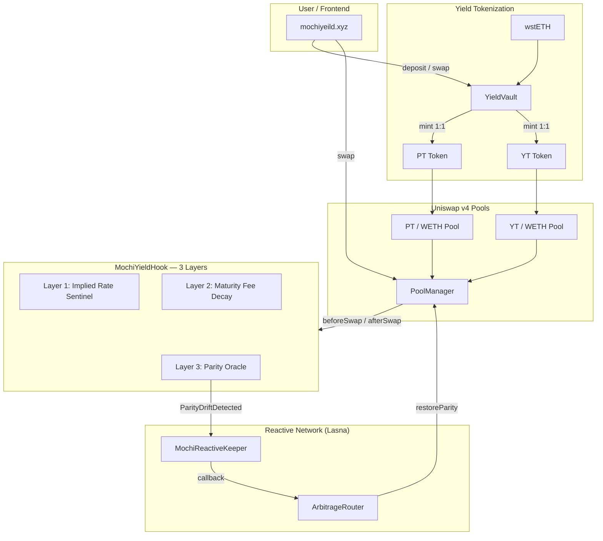
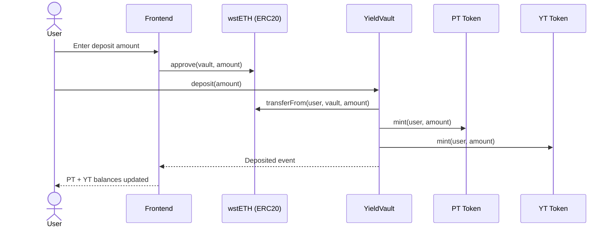
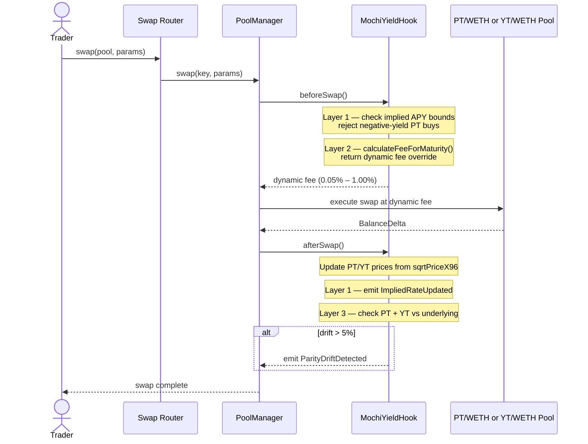
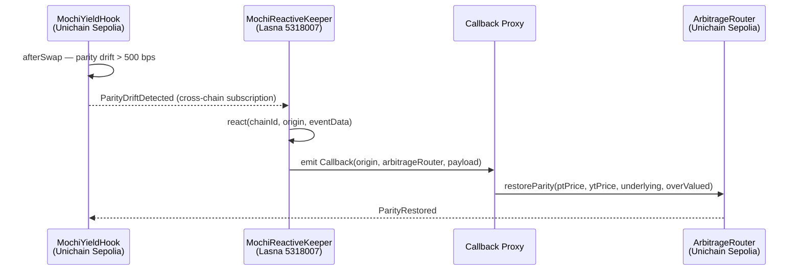
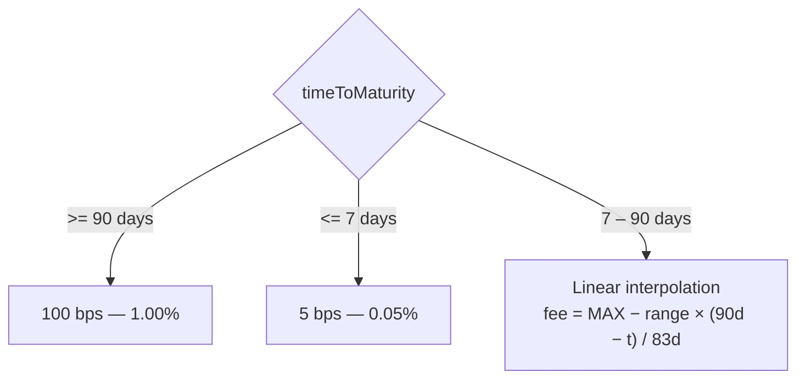

# Mochi Yield

**Time-Aware Fixed Income Markets on Uniswap v4**

[](https://mochiyeild.xyz)
[](https://mochiyeild.xyz/whitepaper)
[](https://mochiyeild.xyz/slides)
[](https://github.com/karar189/mochitrade)

---

## Links

| Resource | URL |
|----------|-----|
| **Live App** | [mochiyeild.xyz](https://mochiyeild.xyz) |
| **Docs (Whitepaper)** | [mochiyeild.xyz/whitepaper](https://mochiyeild.xyz/whitepaper) |
| **Slides** | [mochiyeild.xyz/slides](https://mochiyeild.xyz/slides) |
| **Markets** | [mochiyeild.xyz/markets](https://mochiyeild.xyz/markets) |
| **Deposit** | [mochiyeild.xyz/deposit](https://mochiyeild.xyz/deposit) |
| **Analytics** | [mochiyeild.xyz/analytics](https://mochiyeild.xyz/analytics) |
| **GitHub** | [github.com/karar189/mochitrade](https://github.com/karar189/mochitrade) |
| **PRD** | [prd.md](./prd.md) |
| **Reactive Integration** | [reactive/README.md](./reactive/README.md) |

---

## One-Line Pitch

The first Uniswap v4 hook that understands yield curves — enforcing implied rate bounds, time-to-maturity fee decay, and cross-pool PT/YT parity in a single atomic hook.

---

## What Makes This Different

| Generic Dynamic Fee Hook | Mochi Yield |
|--------------------------|-------------|
| "Fee changes on volume" | Fee decays as PT approaches maturity (volatility decreases) |
| Any AMM can do this | **Only v4 can enforce cross-pool invariants atomically** |
| No fixed-income logic | **Implied APY bounds prevent negative yields on-chain** |
| Events are just logs | **Reactive Network auto-executes parity corrections** |

---

## System Architecture



---

## Deposit Flow

Deposit wstETH into the vault and receive equal amounts of PT + YT — split your yield exposure without selling the underlying.



After maturity, burn PT to redeem underlying 1:1 via `redeem(ptAmount)`.

---

## Swap Hook Flow

Every swap on a registered PT or YT pool passes through three hook layers before and after execution.



---

## Reactive Parity Flow

When PT + YT drifts more than 5% from the underlying price, the hook emits an event that Reactive Network picks up and routes back to the origin chain.



See [reactive/README.md](./reactive/README.md) for deploy steps and E2E verification.

---

## Maturity Fee Decay

Fees decrease as time-to-maturity shrinks — far from expiry, LPs face more volatility risk; near maturity, risk is lower.



| Time to Maturity | Fee |
|------------------|-----|
| ≥ 90 days | 1.00% (100 bps) |
| 7 – 90 days | Linear interpolation |
| ≤ 7 days | 0.05% (5 bps) |

---

## Repository Structure

```
mochi/
├── contracts/          # Foundry — hook, vault, tokens, tests, deploy scripts
│   ├── src/hook/       # MochiYieldHook.sol
│   ├── src/vault/      # YieldVault.sol
│   ├── src/tokens/     # PTToken.sol, YTToken.sol
│   ├── src/reactive/   # MochiReactiveKeeper, ArbitrageRouter
│   └── test/           # Foundry test suites
├── frontend/           # Next.js app (landing, deposit, markets, analytics)
│   └── src/app/
│       ├── whitepaper/ # Technical docs
│       └── slides/     # Presentation deck
├── reactive/           # Reactive Network integration guide
└── prd.md              # Product requirements document
```

---

## Contracts

| Contract | Description |
|----------|-------------|
| `MochiYieldHook.sol` | Main v4 hook — implied rate, fee decay, parity oracle |
| `YieldVault.sol` | Deposit underlying → mint PT + YT |
| `PTToken.sol` | Principal Token (fixed income exposure) |
| `YTToken.sol` | Yield Token (yield speculation) |
| `MochiReactiveKeeper.sol` | Reactive subscriber for parity drift events |
| `ArbitrageRouter.sol` | Origin-chain callback handler for parity restoration |
| `MockWstETH.sol` | Test mock for wstETH |

---

## Deployed Contracts (Unichain Sepolia)

**Network:** [Unichain Sepolia](https://sepolia.unichain.org) · **Chain ID:** `1301` · **Explorer:** [Blockscout](https://unichain-sepolia.blockscout.com)

Latest deploy succeeded on-chain (recorded in `contracts/broadcast/Deploy.s.sol/1301/run-latest.json`). A `txpool is full` error at the end of the script did not prevent these contracts from landing.

| Contract | Address | Verified |
|----------|---------|----------|
| MockWstETH | [`0x2c36B42B1FDc25429F344E5810fE14e21E8C4e9E`](https://unichain-sepolia.blockscout.com/address/0x2c36B42B1FDc25429F344E5810fE14e21E8C4e9E) | Yes |
| Mock WETH | [`0xD2E4BCBdbdc94f42A0326964E8CEC81c6fECf2Fb`](https://unichain-sepolia.blockscout.com/address/0xD2E4BCBdbdc94f42A0326964E8CEC81c6fECf2Fb) | Yes |
| PT Token | [`0xb2c25e8F64236E374283f82F6dFC5F362A78B5D1`](https://unichain-sepolia.blockscout.com/address/0xb2c25e8F64236E374283f82F6dFC5F362A78B5D1) | Yes |
| YT Token | [`0x2B21322dfA81FcF928B0ad3e1648E5A0aC62E115`](https://unichain-sepolia.blockscout.com/address/0x2B21322dfA81FcF928B0ad3e1648E5A0aC62E115) | Yes |
| YieldVault | [`0xBd3c4b2849229f590154d4C11F127Cf0534aAC01`](https://unichain-sepolia.blockscout.com/address/0xBd3c4b2849229f590154d4C11F127Cf0534aAC01) | Yes |
| MochiYieldHook | [`0x1f592B54a638d55056Ad45ed810814F7880580c0`](https://unichain-sepolia.blockscout.com/address/0x1f592B54a638d55056Ad45ed810814F7880580c0) | Yes |

**Frontend env (Vercel / `.env.local`):**

```bash
NEXT_PUBLIC_CHAIN_ID=1301
NEXT_PUBLIC_HOOK=0x1f592B54a638d55056Ad45ed810814F7880580c0
NEXT_PUBLIC_VAULT=0xBd3c4b2849229f590154d4C11F127Cf0534aAC01
NEXT_PUBLIC_PT_TOKEN=0xb2c25e8F64236E374283f82F6dFC5F362A78B5D1
NEXT_PUBLIC_YT_TOKEN=0x2B21322dfA81FcF928B0ad3e1648E5A0aC62E115
```

Local Anvil addresses (chain `31337`) remain in `frontend/src/lib/deployments.json` for offline dev.

---

## Hook Features

### Layer 1: Implied Rate Sentinel
- Calculates implied APY from PT price and time-to-maturity
- Rejects swaps that would push PT into negative-yield territory
- Emits `ImpliedRateUpdated` and `SwapRejectedNegativeYield`

### Layer 2: Maturity Fee Decay
- Fees decrease as maturity approaches (lower volatility = lower LP risk)
- Far from maturity (>90 days): 1% fee
- Near maturity (<7 days): 0.05% fee
- Smooth linear interpolation between

### Layer 3: Cross-Pool Parity Oracle
- Monitors PT + YT combined value vs underlying
- Emits `ParityDriftDetected` when drift exceeds 5%
- Enables Reactive Network integration for auto-arbitrage

---

## Quick Start

### Contracts

```bash
cd contracts

forge install
forge test
forge build
```

### Frontend

```bash
cd frontend

npm install
npm run dev    # http://localhost:3000
npm run build
```

| Page | Route | Purpose |
|------|-------|---------|
| Landing | `/` | Pitch, PT vs YT, hook features |
| Whitepaper | `/whitepaper` | Technical documentation |
| Slides | `/slides` | Presentation deck |
| Deposit | `/deposit` | Deposit wstETH, view positions |
| Markets | `/markets` | PT/YT pools, fee decay, parity alerts |
| Analytics | `/analytics` | Live hook event monitoring |

---

## Test Results

```
44 tests passed, 0 failed
- 14 MochiYieldHook tests
- 11 PTToken tests
- 11 YieldVault tests
-  6 EasyPosm tests
-  2 ArbitrageRouter tests
```

---

## Events

```solidity
event ImpliedRateUpdated(uint256 maturity, int256 impliedAPY, uint256 ptPrice, uint256 timeToMaturity);
event FeeAdjustedForMaturity(PoolId poolId, uint256 timeToMaturity, uint256 newFeeBps);
event ParityDriftDetected(uint256 ptPrice, uint256 ytPrice, uint256 underlyingPrice, uint256 driftBps, bool isOverValued);
event SwapRejectedNegativeYield(PoolId poolId, address swapper, int256 impliedAPY);
event MarketStressDetected(uint256 timestamp, string reason);
```

---

## Roadmap

| Status | Item |
|--------|------|
| Done | YieldVault, PT/YT tokens, MochiYieldHook (3 layers) |
| Done | Foundry test suite (44 tests) |
| Done | Next.js frontend (landing, deposit, markets, analytics, whitepaper, slides) |
| Done | Testnet deploy on Unichain Sepolia |
| Done | Deploy scripts with hook address mining |
| In progress | Wire frontend to live contract reads + event subscriptions |
| In progress | Reactive Network E2E — parity auto-rebalance (Pattern 1) |
| Planned | Full v4 swap execution in ArbitrageRouter |
| Planned | Maturity auto-settlement via Reactive (Pattern 2) |

---

## License

MIT
